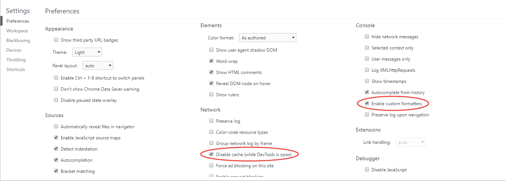

<!-- [](https://github.com/day8/re-frame-template/actions?workflow=ci)
[](https://github.com/day8/re-frame-template/actions?workflow=cd)
[](https://github.com/day8/re-frame-template/tags) -->
[](https://clojars.org/re-frame/lein-template)
[](https://github.com/day8/re-frame-template/issues)
[](https://github.com/day8/re-frame-template/pulls)
[](https://github.com/day8/re-frame-template/blob/master/LICENSE)

# re-frame-template

This is a `Leiningen` template for creating a [re-frame](https://github.com/day8/re-frame) application scaffold (client only).  It will take you 60 seconds to create your first re-frame app and start to edit it.

You can pick and choose what "extras" you'd like included into the scaffold - "extras" like libraries to do routing, debugging and CSS.

## Before You Start

You'll need to install `Clojure` and `Leiningen` (a build tool) by following [these instructions](https://purelyfunctional.tv/guide/how-to-install-clojure/).

## Basic Usage

The base template includes:

* [re-frame](https://github.com/day8/re-frame)
* [shadow-cljs](https://shadow-cljs.github.io/docs/UsersGuide.html)
* [cljs-devtools](https://github.com/binaryage/cljs-devtools)

To create an application with just the base template, use this commandline:
```sh
$ lein new re-frame <app-name>
```
When using this command, you'll need to substitute in your own `<app-name>` - perhaps `my-killer-app` or `an-early-masterpiece`.

> **Troubleshooting note:** for `<app-name>` don't use `cljs`. That name will confuse the compiler (long story) and you will later see errors like `cljs.core.init is not a function`.

## Extras

The following "extras" can be nominated on the commandline when you create the template:

* CSS
  * [garden](https://github.com/noprompt/garden) (`+garden`)
  * [less](https://github.com/montoux/lein-less) (`+less`)
* Debug
  * [re-frame-10x](https://github.com/day8/re-frame-10x) (`+10x`)
  * [re-frisk](https://github.com/flexsurfer/re-frisk) (`+re-frisk`)
* Development
  * [cider](https://github.com/clojure-emacs/cider) (`+cider`)
  * [Calva](https://github.com/BetterThanTomorrow/calva) (`+calva`)
  * [clj-kondo](https://github.com/borkdude/clj-kondo) (`+kondo`)
  * [cljs.test](https://github.com/clojure/clojurescript/blob/master/src/main/cljs/cljs/test.cljs) (`+test`)
  * [git-inject](https://github.com/day8/lein-git-inject) (`+git-inject`)
* Full-stack
  * [compojure](https://github.com/weavejester/compojure) (`+handler`)
* Misc.
  * [re-com](https://github.com/day8/re-com) (`+re-com`)
  * [re-pressed](https://github.com/gadfly361/re-pressed) (`+re-pressed`)
  * [breaking-point](https://github.com/gadfly361/breaking-point) (`+breaking-point`)
* Routing
  * [bidi](https://github.com/juxt/bidi) and [pushy](https://github.com/kibu-australia/pushy) (`+routes`)

To add an `extra` to the base template, append its name to the commandline, with a leading `+`. Here's an example of adding `re-com`:

```
lein new re-frame <app-name> +re-com
```
Note: it is `+re-com`, not just `re-com`.

Any combination of `extras` can be added at once:

```
lein new re-frame <app-name> +garden +re-com +routes +test +less +10x
```

>  Note: to assist debugging, you'll want to include either `+10x` or `+re-frisk`

## Start Cider from Emacs (if using +cider):

Refer to the [shadow-cljs Emacs / CIDER documentation](https://shadow-cljs.github.io/docs/UsersGuide.html#cider).

The mentioned `dir-local.el` file is created by this template.

## Connect Calva from VS Code (if using +calva):

1. Issue the command **Calva: Start a Project REPL and Connect (a.k.a Jack-in)**, `ctrl+alt+c ctrl+alt+j`. (This will start the app, so in this workflow you don't do the **Run application** steps outlined below.)
    * Wait for the *Calva says* output pane to say: *Creating cljs repl session...*
1. Open http://localhost:8280 in your browser.
    * Confirm that it says *Hello from re-frame*. (Depending on how long the app takes to compile, you might need to reload the page a few times.)
1. Open a `cljs` file from `src/cljs` and issue **Calva: Load Current File and Dependencies**. `ctrl+alt+c enter`.


See https://calva.io for more on how to use Calva.

### Add Calva settings to an existing project

Do you have a project that was created without the `+calva` option, and want the easy Jack-in anyway? No worries! At https://calva.io/re-frame-template/ you will find the settings needed.

## Compile CSS (if using +garden or +less):

To compile CSS files once.

```sh
lein garden once

lein less once
```


When developing, to automatically recompile CSS files on each file change, use:

```sh
lein garden auto

lein less auto
```

## Run application:

Retrieve dependencies (can take a while the first time):
```sh
lein deps
```

Then run:
```sh
lein watch
```

Wait a bit, perhaps 20 seconds, keeping an eye out for a sign the compile has finished, then browse to [http://localhost:8280](http://localhost:8280).

To see the other available `shadow-cljs` commands run:
```
lein run -m shadow.cljs.devtools.cli --help
```

## Setting Up Your Browser

So, you now have the application running.

Before you start developing, you should tweak two settings within your
browser's `devtools`. These are one-time actions (for each browser and laptop you use).
I'll assume Chrome for the purposes of further explanation:

1. Open devtools. Press press `F12` or `Ctrl-Shift-i` ([actually there's a variety of ways](https://developer.chrome.com/devtools))
1. Open the devtools "Settings" panel. Press F1. (Careful. Not the settings panel for Chrome itself!! The settings panel for devtools)
1. Under the "Network" heading, tick the option "Disable cache (while DevTools is open)". You don't want shadow-clj's attempts at reloading to be defeated by caching.
1. Under the "Console" heading, tick the option "Enable custom formatters". This allows [cljs-devtools](https://github.com/binaryage/cljs-devtools) to perform its magic.
1. Close Settings. Close Devtools.
1. Reopen Devtools



## Open 10x Panel (if using +10x):

To use `re-frame-10x` for debugging your app:
  1. click on the application, minimal through it is, to give it "input focus" (you want to be sure that any key presses are going to your new app)
  2. press `Ctrl-H` and you should see the `re-frame-10x` panel appear on the right side of the window

Sometimes achieving Step 1 on a really simple app - one without widgets - can be fiddly,
because the browser itself hogs "input focus" and grabs all the keystrokes (like `Ctrl-H`) which don't
then make it through to your app. You may need to be determined and creative with Step 1.
I have every confidence in you.

## Hot Reloading Is Now Go

If you now edit files, shadow-clj will automatically
recompile your changes and "hot load" them into your running app, without your app needing
to be re-started. The resulting fast, iterative workflow tends to make you very productive, and
is cherished by those lucky enough to experience it.

Start by editing this file: `/src/cljs/<app-name>/views.cljs`.

### debug?:

In the namespace _app-name.config_, there is a var called `debug?`, which defaults to
_true_ in the `dev` build, and _false_ in the `prod` build.

If, for example, you wrap your `println`s with a `when` block as shown below,
then you will get logs printed to the browser's console for the `dev` build and
not the `prod` build.

```clojure
(when config/debug?
  (println "dev mode"))
```

## Run tests (if using +test):

Install karma and headless chrome

```
npm install -g karma-cli
```

And then run your tests

```
lein watch
```
And in another terminal:
```
karma start
```

## Production Build

To compile clojurescript to javascript:

```
lein release
```

### Deploy to heroku (if using `+handler`)

Create uberjar

```
lein clean
lein uberjar
```

Create app on heroku

```
git init .
git add -A
git commit -m "Initial commit"
heroku create
heroku buildpacks:add heroku/nodejs
heroku buildpacks:add heroku/clojure
```

Specify node.js version:

```
heroku config:set NODEJS_VERSION=<version-of-choice>
```

Then deploy the application

```
git push heroku master
```

## How to Add Dependencies

Your new application is built by a tool chain which combines  [shadow-cljs](http://shadow-cljs.org/) (a modern CLJS compiler) and [Leiningen](https://leiningen.org/) (a traditional Clojure build tool). The two are brought together via a Leiningen plugin called [Lien-shadow](https://gitlab.com/nikperic/lein-shadow).

There are three files of interest:
  -  `project.clj` - edit this file if you want to add Clojure and ClojureScript dependency as [you would for a normal
Leiningen project](https://github.com/technomancy/leiningen/blob/stable/doc/TUTORIAL.md#dependencies).
  - `package.json` - do not edit this file. With this tool chain, it is a generated file, and your edits will be lost.
  - `src/cljs/deps.cljs` - edit this file if you want to add a JavaScript and NPM dependency

Within `deps.cljs`, there are two sections of interest:
```clojure
{:npm-deps     {"pako"                  "1.0.10"}
 :npm-dev-deps {"shadow-cljs"           "2.9.0"
                "karma"                 "4.4.1"
                "karma-chrome-launcher" "3.1.0"
                "karma-cljs-test"       "0.1.0"
                "karma-junit-reporter"  "2.0.1"}}
```

If you are adding a dependency to your application, like a React component, or a JavaScript library like
P5, then add it to the `:npm-deps` section.

If you are adding a build or test dependency, like a Karma runner, put it into the `:npm-dev-deps` section.

## Other Templates

* [chestnut](https://github.com/plexus/chestnut)
* [luminus](https://github.com/luminus-framework/luminus-template)  (full stack)
* [reagent-figwheel](https://github.com/gadfly361/reagent-figwheel)
* [reagent-seed](https://github.com/gadfly361/reagent-seed)

## Backend Options

* [ring](https://github.com/ring-clojure/ring) and [liberator](http://clojure-liberator.github.io/liberator/)
* [duct](https://github.com/duct-framework/duct)
* [yada](https://github.com/juxt/yada)
* [pedestal](https://github.com/pedestal/pedestal) and [vase](https://github.com/cognitect-labs/vase)

## More re-frame

Looking for more re-frame inspiration, templates or example applications?
See the [external resources](https://github.com/day8/re-frame/blob/master/docs/External-Resources.md) docs page.

## Contributing

Contributions are welcomed!  To add a new profile, this is what I'd recommend:

1. Add a file with the name of the profile [here](https://github.com/day8/re-frame-template/tree/master/src/leiningen/new/options)
2. Look at the existing options in that folder for inspiration for what to include in that file
3. Update [project.clj](https://github.com/day8/re-frame-template/blob/master/src/leiningen/new/re_frame.clj) with the profile
4. Add any new files [here](https://github.com/day8/re-frame-template/tree/master/src/leiningen/new/re_frame) and use the {{ var-name }} syntax as needed
5. Update the [README](https://github.com/day8/re-frame-template/tree/master/src/leiningen/new/re_frame) that will result when the template is used, as well as the top-level [README](https://github.com/day8/re-frame-template/blob/master/README.md) for re-frame-template itself
6. In a terminal, at the root of re-frame-template, run `lein install`
7. Locally test that your profile works, `lein new re-frame <app-name> +<profile-name>`
8. Add your profile to [create-templates](https://github.com/day8/re-frame-template/blob/master/create-templates.sh) and run the script to make sure the other profiles didn't break.

## License

```
The MIT License (MIT)

Copyright © 2015 Matthew Jaoudi
Copyright © 2015 Dylan Paris
Copyright © 2015 Michael Thompson
Copyright © 2015 Markku Rontu
Copyright © 2016 Daniel Compton
Copyright © 2019 Isaac Johnston

Permission is hereby granted, free of charge, to any person obtaining a copy
of this software and associated documentation files (the "Software"), to deal
in the Software without restriction, including without limitation the rights
to use, copy, modify, merge, publish, distribute, sublicense, and/or sell
copies of the Software, and to permit persons to whom the Software is
furnished to do so, subject to the following conditions:

The above copyright notice and this permission notice shall be included in all
copies or substantial portions of the Software.

THE SOFTWARE IS PROVIDED "AS IS", WITHOUT WARRANTY OF ANY KIND, EXPRESS OR
IMPLIED, INCLUDING BUT NOT LIMITED TO THE WARRANTIES OF MERCHANTABILITY,
FITNESS FOR A PARTICULAR PURPOSE AND NONINFRINGEMENT. IN NO EVENT SHALL THE
AUTHORS OR COPYRIGHT HOLDERS BE LIABLE FOR ANY CLAIM, DAMAGES OR OTHER
LIABILITY, WHETHER IN AN ACTION OF CONTRACT, TORT OR OTHERWISE, ARISING FROM,
OUT OF OR IN CONNECTION WITH THE SOFTWARE OR THE USE OR OTHER DEALINGS IN THE
SOFTWARE.
```
